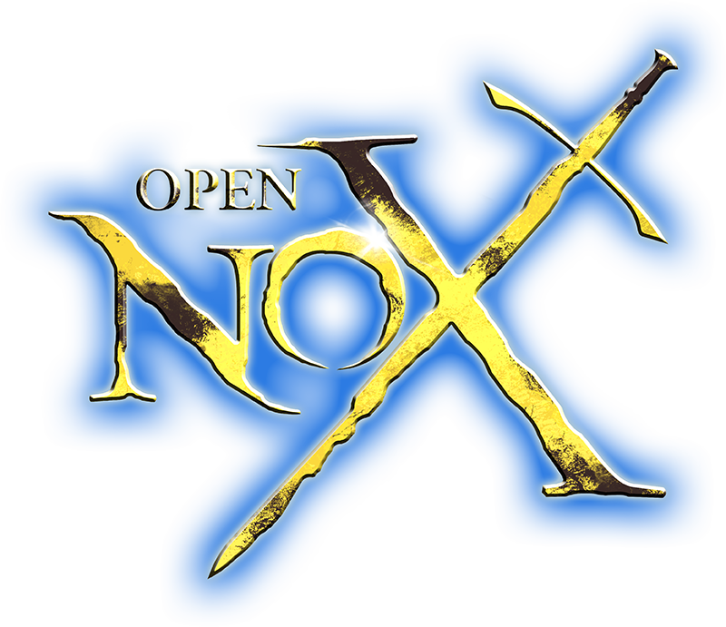

    

    <b>OpenNox</b> is an open-source community collaboration project extending the Nox engine. 

    
    
     
    
    
    

## Download OpenNox

### Release
All release builds are made from the `dev` branch. Recent OpenNox releases can be found [here](<https://github.com/noxworld-dev/opennox/releases>).

Linux releases are also available in `stable` channel of our [Snap package](https://snapcraft.io/opennox).

### Nightly
On each commit, an automated build of the `dev` branch is uploaded.
These builds contain all the latest merged features, but are not yet considered stable for release.
These builds are to help provide an insight to what the next release will contain and should only be used for active playtesting purposes **only**.

Linux nightly builds are also available in `edge` channel of our [Snap package](https://snapcraft.io/opennox).

## Build OpenNox
**NOTE: This section is only for people who wish to build the source code locally.**

### Linux
- [Linux](./docs/build-linux.md)
- [Linux (C only)](./docs/build-linux-legacy.md)
  
### Windows
- [Windows](./docs/build-windows.md)
- [Windows (on Linux)](./docs/build-windows-on-linux.md)
- [Windows (C only, MinGW)](./docs/build-windows-legacy-mingw.md)
- [Windows (C only, MSVC)](./docs/build-windows-legacy-msvc.md)

## Contributing
Read [CONTRIBUTING](CONTRIBUTING.md)!

## Legal

This project (OpenNox) is an unofficial community collaboration project for preservation, modding and compatibility purposes.
This project has no direct affiliation with Electronic Arts Inc. and/or the "Nox" brand. "Nox" is an Electronic Arts Inc. brand. All Rights Reserved.

No assets, texts, artwork or other media from the original game(s) is included in this project.
We do not condone piracy in any way, shape or form and encourage users to legally own the original game.

The video game "Nox" is copyright © 2000 Westwood Studios. All Rights Reserved.
Westwood Studios is a trademark or registered trademark of Electronic Arts in the U.S. and/or other countries. All rights reserved.

The source code provided in this repository is licenced under the [GNU General Public License version 3](<https://www.gnu.org/licenses/gpl-3.0.html>). Please see the accompanying LICENSE file.

OpenNox project additionally follows [C&C Remastered Modding guideline](https://www.ea.com/games/command-and-conquer/command-and-conquer-remastered/modding-faq). All changes to the project MUST follow these rules. 
