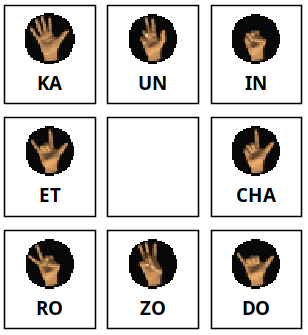
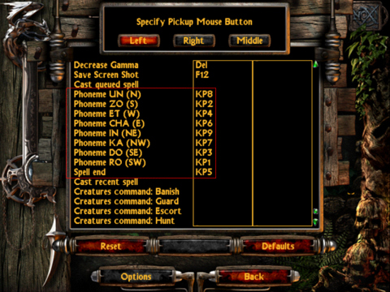

# Manual spell casting

Surprisingly, vanilla Nox has a hidden feature that allows casting spells manually by pressing one of 9 phoneme/gesture
keys in the right order to cast specific spells. It is similar to the way spell casting works in Magicka.

OpenNox restores this feature by default. Manually casting each spell is challenging, thus we think that it doesn't
give any advantage in multiplayer (actually the opposite), so can be enabled safely.

All that needs to be done to use it to set hotkeys in OpenNox input options.
There are 8 main phonemes, plus a special "end" phoneme to finish and cast the spell.

It's typical to use numpad keys for phonemes where `5` or `Enter` is an "end" phoneme, and actual phonemes occupy other number keys:

    
    

Another typical layout is to use QWER-ASDF block for 8 phonemes and set "end" to any key that is close enough.

For more details, see [this post](https://www.patreon.com/posts/53809724).
